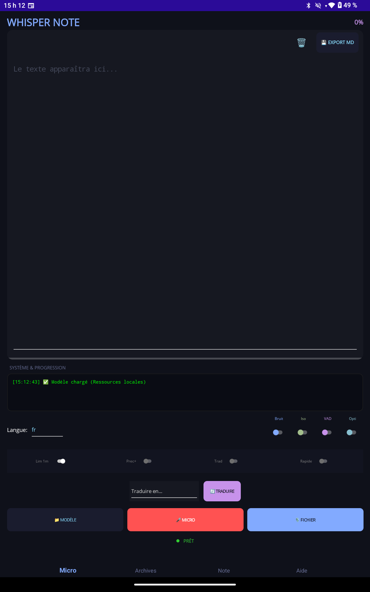
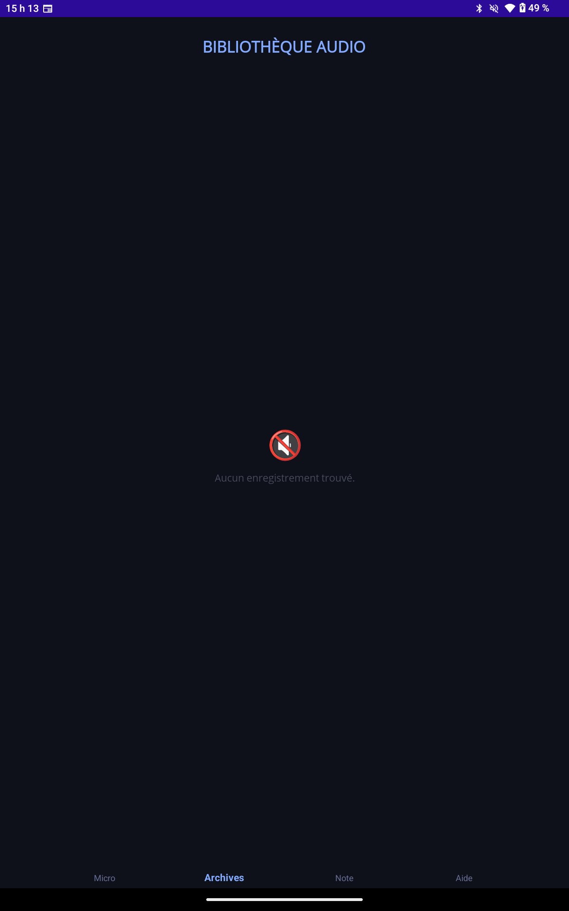
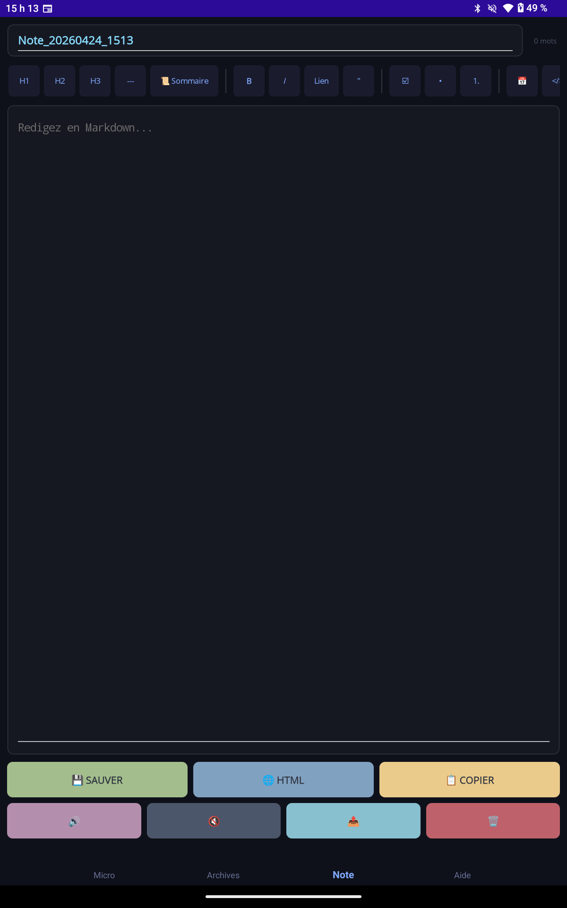

# 🎙️ WhisperNote

> **La puissance de l'IA Whisper, dans votre poche, 100% hors-ligne.**

**WhisperNote** est une application mobile puissante développée avec **.NET MAUI 9.0**, conçue pour transformer la voix en texte de manière intelligente et locale. En utilisant la technologie de pointe **OpenAI Whisper**, l'application permet de capturer des idées, des réunions ou des notes vocales et de les convertir instantanément en texte, tout en offrant des outils de gestion de notes complets.

---

### 📱 Aperçu de l'interface

| Centre de contrôle (Main) | Éditeur Markdown | Section À propos |
| :---: | :---: | :---: |
|  |  |  |

---

## ✨ Fonctionnalités Principales

### 🎙️ Transcription Intelligente
- **Moteur IA Local** : Utilise les modèles Whisper (ONNX) pour transcrire l'audio sans envoyer vos données sur le cloud (respect de la vie privée).
- **Enregistrement Direct** : Capturez l'audio via le micro de votre appareil avec une limite de sécurité d'une minute pour les notes rapides.
- **Import de Fichiers** : Importez vos fichiers audio existants pour une transcription a posteriori (limite étendue à 20 minutes).
- **Suivi en Temps Réel** : Indicateur de progression et journal d'activité pour suivre le travail de l'IA.

### 📝 Édition et Gestion de Notes
- **Éditeur Markdown** : Un éditeur de texte riche supportant le format Markdown pour structurer vos notes (titres, gras, listes).
- **Bibliothèque Audio** : Gérez vos enregistrements vocaux dans une interface dédiée avec prévisualisation des dates et tailles de fichiers.
- **Gestion de fichiers** : Sauvegarde automatique dans le dossier `Documents/prout_record_md` de votre appareil Android.

### 🌐 Outils Avancés
- **Traduction Multilingue** : Traduction intégrée (via Microsoft Translator) vers le Russe, l'Espagnol et l'Anglais.
- **Lecture Vocale (TTS)** : Écoutez vos notes grâce au moteur de synthèse vocale intégré.
- **Export & Partage** : Exportez vos transcriptions au format `.md` ou partagez vos fichiers audio et textes directement via vos applications préférées.

---

## 🛠️ Stack Technique

- **Framework** : .NET MAUI 9.0 (C#)
- **Intelligence Artificielle** : Microsoft.ML.OnnxRuntime (Modèles Whisper quantifiés)
- **Traitement Audio** : Android.Media (AudioRecord)
- **UI/UX** : Design moderne avec animations de particules (AboutPage) et interface sombre (Dark Mode) optimisée.
- **Stockage** : Système de fichiers local (Offline-first).

---

## 📂 Structure de l'Application

L'application est divisée en 4 sections principales :
1.  **MainPage** : Le centre de contrôle pour l'enregistrement et la transcription.
2.  **RecordsPage** : La bibliothèque pour gérer et réécouter vos fichiers audio.
3.  **NotesPage** : La liste de toutes vos transcriptions sauvegardées.
4.  **NoteEditorPage** : L'outil d'édition pour peaufiner vos textes et les exporter.

---

## 🚀 Installation (Développement)

### Prérequis
- Visual Studio 2022 avec la charge de travail **Développement .NET MAUI**.
- Un appareil Android (physique ou émulateur) avec l'API 31+ recommandée.

### Configuration
1. Clonez le dépôt.
2. Placez vos modèles ONNX (`whisper_model.onnx`, etc.) et le vocabulaire (`vocab.json`) dans le dossier `Resources/Raw`.
3. Configurez vos clés de service (si vous utilisez la traduction Azure) dans `TranslationService.cs`.
4. Compilez et déployez sur votre appareil.

---

## 📄 Licence et Crédits

- **Auteur** : François (Xartoff)
- **Site Web** : [pouetpouet.ca](https://pouetpouet.ca)
- **Moteur IA** : Basé sur OpenAI Whisper.

---
*Note : Cette application est développée dans une optique de performance locale et de simplicité d'utilisation pour les professionnels.*
